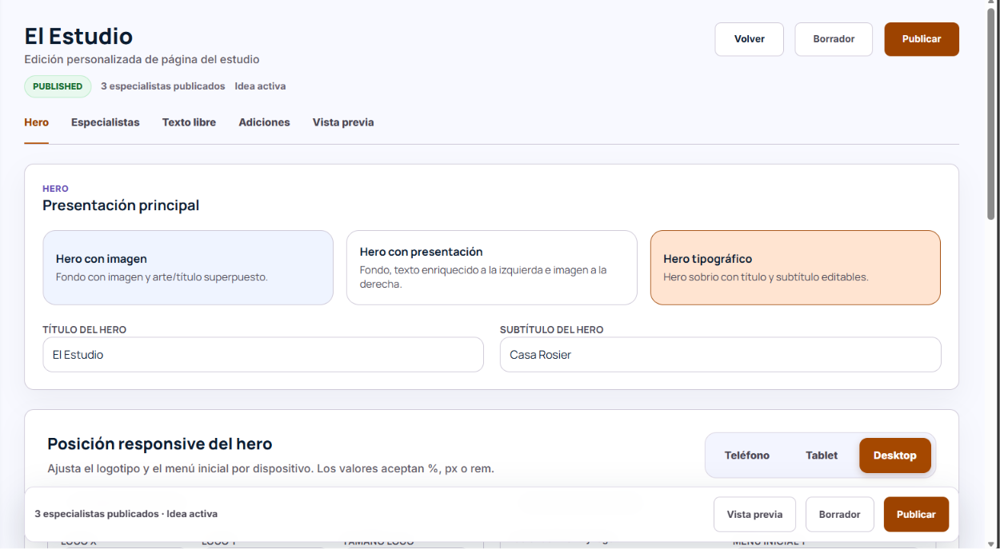
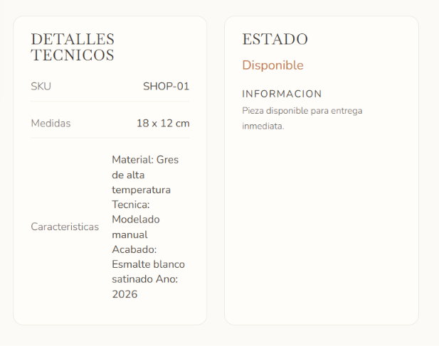

# Crear el menú de Shop

Enfoque: CMS
Tipo: Feature

Esta será una sección nueva para editar todo lo que se encuentre de la página de /shop será asi como la página de edición del CMS como del estudio . Tendrá los apartados como:
- Hero: tal cual como hemos estado trabajando con la edición de tipos de hero como la imagen proporcionado.
- Artículos: Aqui se mostrará una tabla de creación de todos los articulos, cada artículo tiene como la página: /shop/jarron-de-gres-blanco
esas son las variables a editar, el renderizada para que tenga la tipografía que se requiere.
- Renderizado: en el renderizado, las características debe ser otra tabla, para que se vea correctamente usa la skill /ui-ux-pro-max-skill