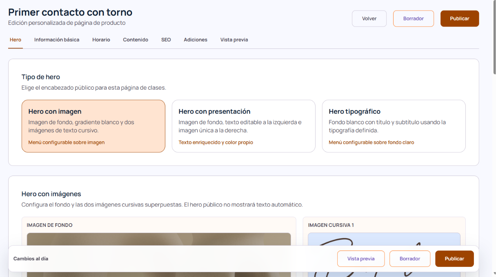

# Home editable
Enfoque: CMS
Tipo: Feature

- Poder permitir poner carousel principal, el cual es un carousel que muestra una imagen, un texto (título) y un botón.
Componente: 
```html
<section id="intro" class="home-intro-slider section"><div class="carousel container home-intro-slider__inner" aria-roledescription="carousel" aria-label="Introduccion visual Casa Rosier"><div class="carousel__viewport home-intro-slider__viewport"><div class="carousel__track home-intro-slider__slides" style="transform: translateX(-300%);"><div class="carousel__slide home-intro-slider__slide" id="intro-1"><div class="intro-slider-image"></div><div class="intro-slider-content"><div class="intro-slider-content__inner"><p class="intro-slider-content__text">Un espacio para tocar la arcilla, aprender con calma y crear piezas con una mirada propia.</p><a class="intro-slider-content__button" href="/clases">Reserva una experiencia</a></div></div></div><div class="carousel__slide home-intro-slider__slide" id="intro-2"><div class="intro-slider-image"></div><div class="intro-slider-content"><div class="intro-slider-content__inner"><p class="intro-slider-content__text">Ceramica, materia y tiempo para crear con las manos en Barcelona.</p><a class="intro-slider-content__button" href="/clases">Ver clases</a></div></div></div><div class="carousel__slide home-intro-slider__slide" id="intro-3"><div class="intro-slider-image"></div><div class="intro-slider-content"><div class="intro-slider-content__inner"><p class="intro-slider-content__text">Clases y workshops para explorar la ceramica desde la practica y el proceso.</p><a class="intro-slider-content__button" href="/workshops">Ver workshops</a></div></div></div><div class="carousel__slide home-intro-slider__slide" id="intro-4"><div class="intro-slider-image"></div><div class="intro-slider-content"><div class="intro-slider-content__inner"><p class="intro-slider-content__text">Un taller para probar, equivocarse, volver a empezar y descubrir nuevas formas.</p><a class="intro-slider-content__button" href="/el-estudio">Conoce el estudio</a></div></div></div></div></div><div class="carousel__dots home-intro-slider__dots"><button class="carousel__dot home-intro-slider__dot" type="button" aria-label="Ir al slide 1" aria-controls="intro-1" aria-pressed="false"></button><button class="carousel__dot home-intro-slider__dot" type="button" aria-label="Ir al slide 2" aria-controls="intro-2" aria-pressed="false"></button><button class="carousel__dot home-intro-slider__dot" type="button" aria-label="Ir al slide 3" aria-controls="intro-3" aria-pressed="false"></button><button class="carousel__dot home-intro-slider__dot is-active" type="button" aria-label="Ir al slide 4" aria-controls="intro-4" aria-pressed="true"></button></div></div></section>
```

- Modificar el Carousel de “Cusos y Talleres” solo son destacados de Clases
Componente:
```html
<div class="container featured__container"><header class="featured__head"><h2 class="featured__title section-title">Cursos y Talleres de Ceramica</h2><p class="featured__subtitle section-subtitle">En Barcelona</p></header><div class="featured__grid cards-grid"><article class="content-card"><a class="content-card__media" href="/clases/primer-contacto-con-torno"></a><div class="content-card__body"><p class="content-card__meta">Clases - Iniciacion</p><h3 class="content-card__title card__title">Primer contacto con torno</h3><p class="content-card__excerpt body-text">Una experiencia guiada para crear y decorar tu primera pieza, sin experiencia previa.</p><a class="content-card__cta" href="/clases/primer-contacto-con-torno">leer mas</a></div></article><article class="content-card"><a class="content-card__media" href="/clases/modelado-expresivo"></a><div class="content-card__body"><p class="content-card__meta">Clases - Modelado</p><h3 class="content-card__title card__title">Modelado expresivo</h3><p class="content-card__excerpt body-text">Construccion manual para crear volumen, textura y lenguaje propio.</p><a class="content-card__cta" href="/clases/modelado-expresivo">leer mas</a></div></article><article class="content-card"><a class="content-card__media" href="/clases/color-y-acabados"></a><div class="content-card__body"><p class="content-card__meta">Clases - Esmaltes</p><h3 class="content-card__title card__title">Color y acabados</h3><p class="content-card__excerpt body-text">Un taller para entender color, materia y reaccion de la superficie con una mirada precisa.</p><a class="content-card__cta" href="/clases/color-y-acabados">leer mas</a></div></article></div></div>
```
- Modificar los “Workshops de especialización” solo son los destacados de Workshops.
Componente:
```html
<section id="workshops-destacados" class="featured section featured--workshops"><div class="container featured__container"><header class="featured__head"><h2 class="featured__title section-title">Workshops de Especializacion</h2><p class="featured__subtitle section-subtitle">En Barcelona</p></header><div class="featured__grid cards-grid"><article class="content-card"><a class="content-card__media" href="/workshops/gran-formato"></a><div class="content-card__body"><p class="content-card__meta">Workshop - Intensivo</p><h3 class="content-card__title card__title">Piezas de gran formato</h3><p class="content-card__excerpt body-text">Metodos de estructura y secado para trabajar escala sin deformaciones.</p><a class="content-card__cta" href="/workshops/gran-formato">leer mas</a></div></article><article class="content-card"><a class="content-card__media" href="/workshops/torno-avanzado"></a><div class="content-card__body"><p class="content-card__meta">Workshop - Avanzado</p><h3 class="content-card__title card__title">Torno avanzado</h3><p class="content-card__excerpt body-text">Ritmo, simetria y precision para elevar tu repertorio tecnico.</p><a class="content-card__cta" href="/workshops/torno-avanzado">leer mas</a></div></article><article class="content-card"><a class="content-card__media" href="/workshops/experimentacion-material"></a><div class="content-card__body"><p class="content-card__meta">Workshop - Creativo</p><h3 class="content-card__title card__title">Experimentacion material</h3><p class="content-card__excerpt body-text">Pruebas de pasta, superficies y combinaciones para nuevas series.</p><a class="content-card__cta" href="/workshops/experimentacion-material">leer mas</a></div></article></div></div></section>
```

- Modificar el carousel “Experiencia en ceramica” muestra giftcards destacadas, debe modificarse la base de datos para poder destacar cada giftcard y aparecería en el home lo mismo para los anteriores componentes:
Componente:
```html
<section id="gift-card" class="gift section"><div class="container gift__container"><header class="gift__head"><h2 class="gift__title section-title">Experiencia en Ceramica</h2><p class="gift__subtitle section-subtitle">Regala una Gift Card</p></header><div class="carousel gift-carousel" aria-roledescription="carousel" aria-label="Experiencias en ceramica"><button class="carousel__arrow carousel__arrow--prev gift-carousel__arrow gift-carousel__arrow--prev" type="button" aria-label="Experiencia anterior"><span aria-hidden="true">&lt;</span></button><div class="carousel__viewport gift-carousel__viewport"><div class="carousel__track gift-carousel__track" style="transform:translateX(-0%)"><div class="carousel__slide gift-carousel__slide"><a class="gift-carousel__media" href="/gift-cards/sculpture-class"></a><div class="gift-carousel__body"><p class="gift-carousel__text">Sesion orientada a volumen y textura para crear piezas expresivas con tecnica y control.</p><a class="gift-carousel__cta" href="/gift-cards/sculpture-class">ver mas</a></div></div><div class="carousel__slide gift-carousel__slide"><a class="gift-carousel__media" href="/gift-cards/demo-editor-completo-gift-card"></a><div class="gift-carousel__body"><p class="gift-carousel__text">Pagina demo creada para validar el editor visual completo.</p><a class="gift-carousel__cta" href="/gift-cards/demo-editor-completo-gift-card">ver mas</a></div></div><div class="carousel__slide gift-carousel__slide"><a class="gift-carousel__media" href="/gift-cards/beginner-class"></a><div class="gift-carousel__body"><p class="gift-carousel__text">Una experiencia guiada para introducirte al torno, la forma y el ritmo del taller.</p><a class="gift-carousel__cta" href="/gift-cards/beginner-class">ver mas</a></div></div></div></div><button class="carousel__arrow carousel__arrow--next gift-carousel__arrow gift-carousel__arrow--next" type="button" aria-label="Experiencia siguiente"><span aria-hidden="true">&gt;</span></button></div></div></section>
```

Para cada uno de estos componentes debe asegurarse crear la estructura de la base de datos en supabase, para que, se pueda permitir editar exitosamente, y, para confirmar, vas a modificar cada elemento del home (lo anterior descrito), para demostrar el guardado de supabase y que está listo para producción.

Cada componente que se pueda editar, evidentemente se puede editar el título y subtítulo que tiene cada uno.

Debe crearse en el CMS la categoria de "Setup página" llamada "Home", al entrar a la home se tendrá pestañas para editar cada sección, es decir, como se encuentra en la imagen , en el anterior ejemplo, se ve, el modo de edición del CMS de la edición de una clase, de esa manera se va a editar el home con las pestañas: Carousel destacado, Clases, Workshops, Experiencias (Carousel) y en cada pestaña estará la edición, toda la edición debe ser lo más estético posible, por lo que deberás usar /ui-ux-pro-max-skill 